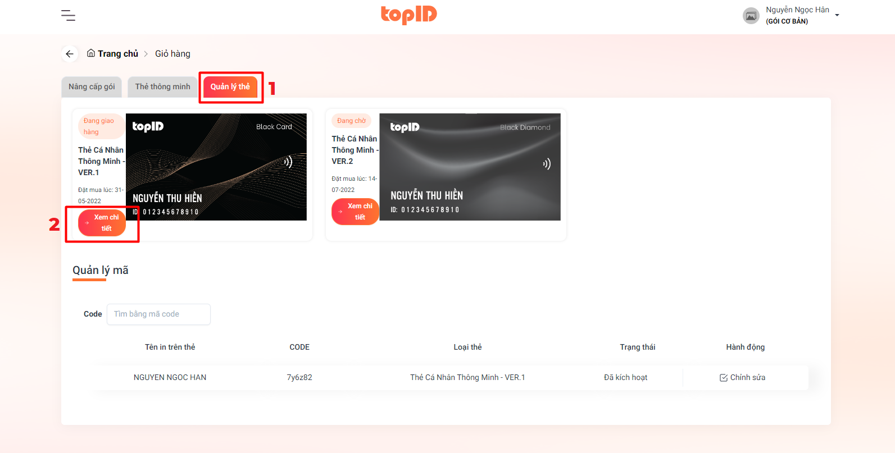

# BƯỚC 2: CHỌN TAB QUẢN LÝ THẺ

Chọn vào Tab <mark style="color:orange;">**Quản lý**</mark> <mark style="color:orange;">**thẻ**</mark>

Tiếp đến chọn vào <mark style="color:orange;">**Xem chi tiết**</mark> loại thẻ mà bạn vừa đặt mua

