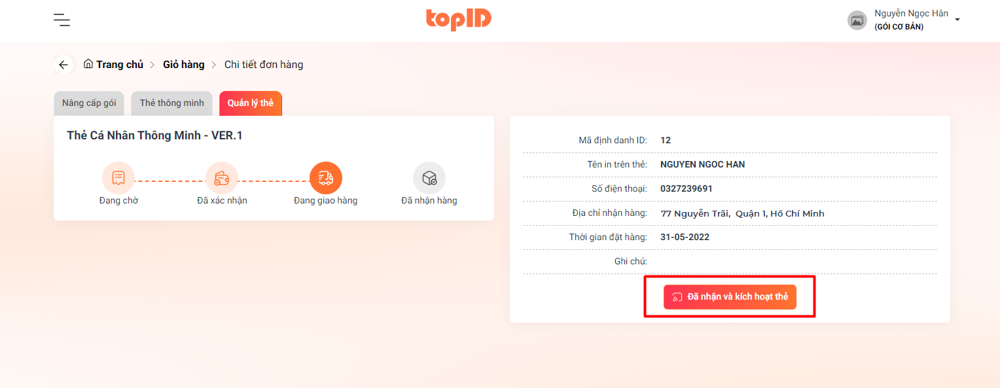

# BƯỚC 3: TIẾN HÀNH KÍCH HOẠT THẺ

Sau khi bạn đã nhận được thẻ hãy chọn vào nút <mark style="color:orange;">**Đã nhận và kích hoạt thẻ**</mark> để tiến hành kích hoạt chiếc thẻ thông minh của mình

